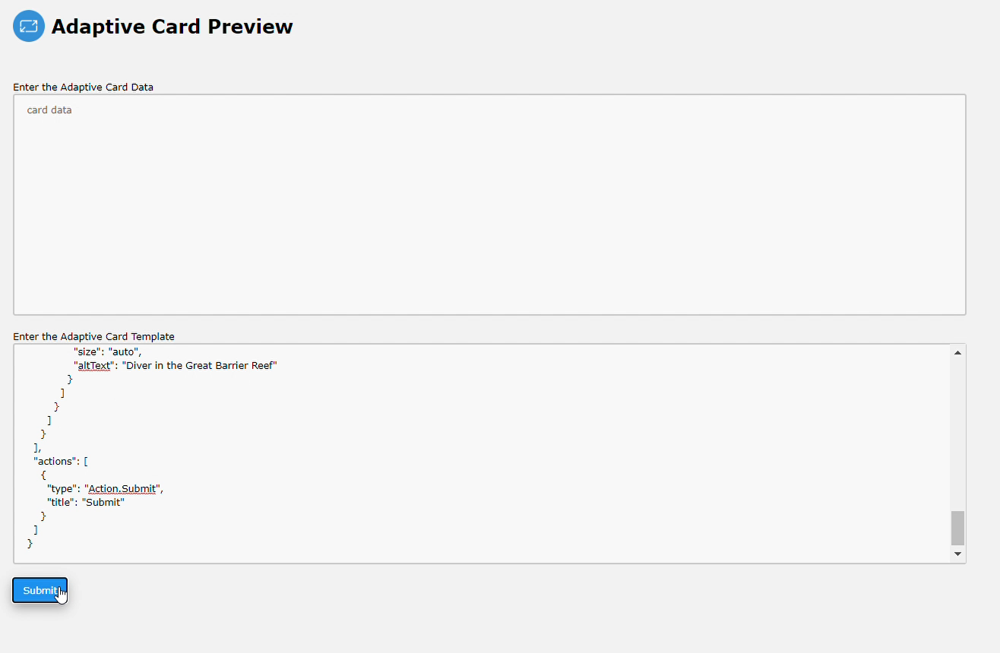
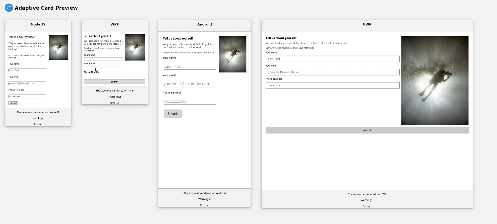

# Consistent Cards
This project provides a web app to test the consistency of an adaptive card payload. It is a web app that allows the user to input the json payload corresponding to an adaptive card and see pictures of their card rendered on android, .NET WPF, node js and UWP. 




## Link to Spec 
[Consistent Cards Spec](https://github.com/microsoft/AdaptiveCards/blob/main/specs/DesignDiscussions/ConsistentCards.md)

This directory contains the following directories:
1. **nodejs-renderer**: This contains the driver program and corresponding Flask App for the node js.
2. **uwp-renderer**: This contains the driver app and corresponding Flask App for the uwp.
3. **android-renderer**: This contains the driver app and corresponding Flask App for android.
4. **dotnetWPF-renderer**: This contains the driver app and corresponding Flask App for .NET WPF. 
5. **ClientApp**: This contains the front end web interface that allows the user to enter the card data and template and see a picture of their card.


## Start The Application
- Ensure that you have built the Visual Studio Project in the dotnetWPF-renderer folder.
- Ensure that you have started the android app on the android emulator. 
- Then open a terminal and type the command `telnet localhost 5554`. Once authorized, enter `redir add tcp:8080` This allows the REST end point within the android emulator app to be accessible  via a browser.
- Ensure that you have built and started the UWP driver app as well. 
- Once this has started, open a powershell and enter `CheckNetIsolation.exe LoopbackExempt -is -n=UWPDriver_75r7ebfpw4g8p`. This allows the UWP app to communicate with the local machine and listen for post requests on the local machine. This would not be necessary when deployed.
- Then you can start the project using the bat file located in the ClientApp folder.. This will start the client app on port 8000 and the three REST API on ports 5000, 4000 and 7000 respectively. These ports can easily be changed. Edit the bat file as follows: 
- to configure the port for the web interface change the line that says `node server.js` to  `node server.js -p PORT ` where PORT is your chosen port number.
- to configure the REST API/Flask Apps, change the line that says `flask run` to `flask run -p PORT` where PORT is your chosen port number.
 
## Adding more platforms to the web interface
Once you have the new platform up and running and accessible via an HTTP POST REST endpoint, it can be added to the client as follows:
- Add the details about the REST end point and request details in `options.js`
- Add the following code to `results.ejs`:
   ```
       <div id="i" class="results w3-container" ></div>

   ```
   where `i` indicates the total number of platforms added so far.


## Deployment 
The first version can be deployed using docker containers. The mentioned dockerfiles can be found under github branch hammad-h/deployment.

### Hosting .NET WPF Driver
Make the following changes to the files dotnetWPF-renderer folder under source/tools/testConsistency before deploying it on a docker container:
1. In **REST_WPF.py** add the following lines at the end:
   ``` 
   if __name__ == "__main__":
    app.run(host="0.0.0.0", port=80)
   ```
   This allows the REST API to run on port 80.
2. In **app/routes.py**, change the line: 
   ```
     res_json = subprocess.run(['WPFDriver/WPFDriver/bin/Debug/WPFDriver.exe'],
                                 input=card_byte_buffer,
                                 capture_output=True
                                 )
    ```
    to 
    ```
     res_json = subprocess.run(['c:/WPFApp/WPFDriver.exe'],
                                input=card_byte_buffer,
                                capture_output=True
                                 )
    ```
3. Build the WPFDriver solution. Then, copy the files from the Release folder to a new directory WPFApp. 
4. Add the WPFApp folder, dockerfile and the **REST_WPF.py** and app folder to the same folder. 
5. Download the windows python3.8.5 installer and add it to the directory which contains the files above. 

   (*A later version of python would work too. Just edit the dockerfile to reflect the name of the installer file.*)

5. Host the docker image on an azure container registry.

### Hosting JavaScript Driver
Make the following changes to the files nodejs-renderer folder under source/tools/testConsistency before deploying it on a docker container:
1. In **REST_nodeJs.py** add the following lines at the end:
   ``` 
   if __name__ == "__main__":
    app.run(host="0.0.0.0", port=80)
   ```
   This allows the REST API to run on port 80.
2. In **app/routes.py**, change the line: 
   ```
    res_json = subprocess.run(['node', 'NodeApp/app.js'],
                              input=card_byte_buffer,
                              capture_output=True,
                              shell=False
                             )
    ```
    to 
    ```
     res_json = subprocess.run(['node', '/src/NodeApp/app.js'],
                              input=card_byte_buffer,
                              capture_output=True,
                              shell=False
                             )
    ```
3. In **NodeApp/app.js**, change the line 36 from: 
   ```
   const browser = await puppeteer.launch();
   ```
   to
   ```
   const browser = await puppeteer.launch({args: ['--no-sandbox', '--disable-setuid-sandbox']});
   ```

4. Copy the dockerfile to nodejs-renderer and host it on an an azure container registry.